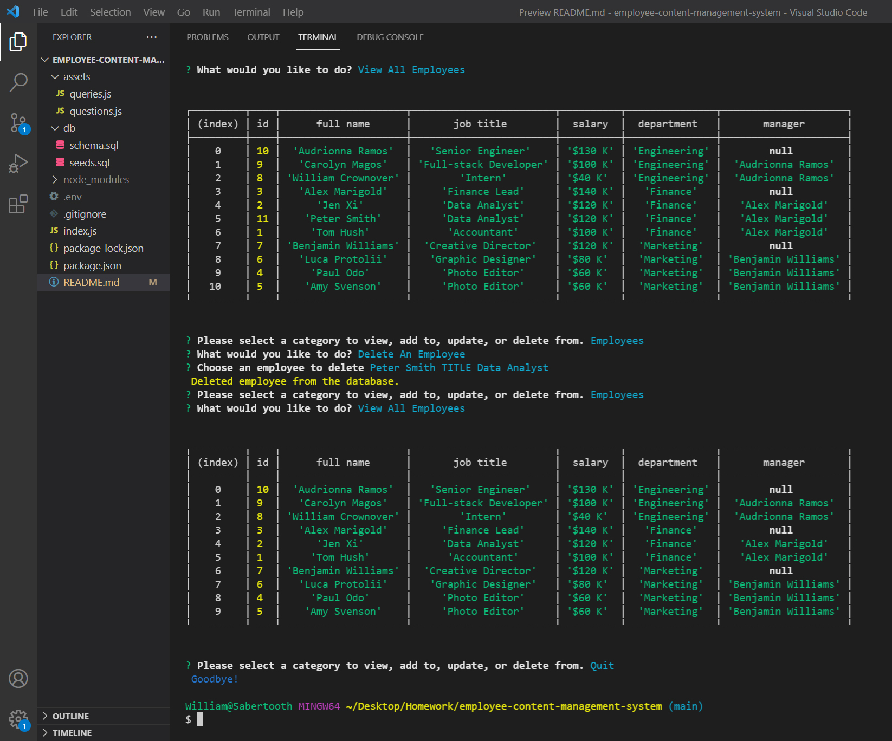

# Employee Content Management System

## Description

This CMS was built with Node.js to help businesses manage their internal departments, roles, and employees using an Inquirer command-line interface connected to a MySQL database. The user can easily navigate through the three categories of data to view tables, add information, update entries, or delete specific data points. Having access to a database keeps the information persistent and makes organizing teams or planning budgets much easier for a business owner. More specifically, the user can view tables that total the combined salaries of all employees grouped by department.

Other technologies that helped the development of the code are ‘dotenv’ for keeping connection passwords confidential and the ‘util’ node module to convert MySQL queries into a promise form. I also took advantage of storing Inquirer questions and query strings in separate files to help dry up the index.js code.



## User Story/Goal

```
AS A business owner
I WANT to be able to view and manage the departments, roles, and employees in my company
SO THAT I can organize and plan my business
```

## Walkthrough Video

https://www.youtube.com/watch?v=kd71u3FCdZQ&ab_channel=WilliamCrownover

## Installation/Dependencies

You will need Node.js installed on your local machine to run this app.
Then you can clone this repo to your local machine.
You can then run it in VSCode and open an integrated terminal of the root folder.
Before use, run `npm install` to load any dependencies such as Inquirer to the folder.

In the root folder create a `.env` file and paste this line of code changing password to your MySQL root user password: `DB_PASS=password`.

To setup the initial database login to the MySQL shell using `mysql -u root -p` and then run the schema file with `source db/schema.sql`.

You may use the seeds.sql file to populate example tables to the database.

## Usage

After proper installation, the app can be run using `node index.js` in the command line.

The first question and the one you will return to after each end of user choices will ask which category of data you’d like to work with. After that you can explore the options for viewing, adding, updating, or deleting data from that chosen category. Have fun!

## Technologies

- Node.js
- MySQL
- Inquirer
- Dotenv 